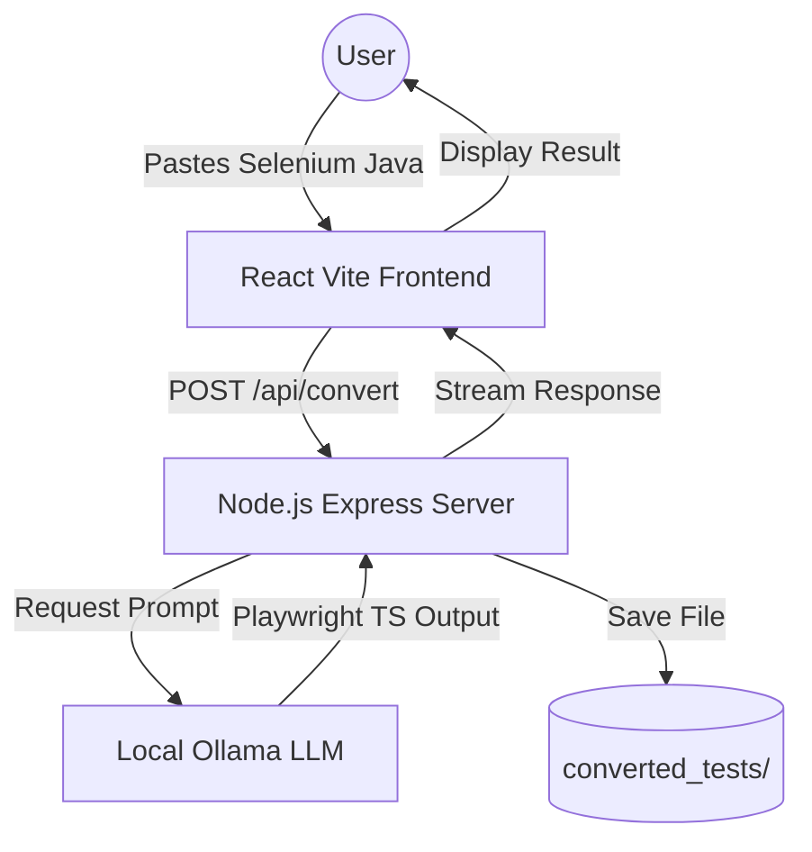

# 🚀 Selenium to Playwright Converter (Local LLM)

A high-performance, privacy-focused automation converter that transforms **Selenium Java (TestNG)** code into **Playwright TypeScript** using a local LLM (Ollama).

## 🌟 Key Features

- **Local & Private**: Powered by Ollama (`qwen2.5-coder:1.5b`), ensuring your source code never leaves your machine.
- **Deterministic Conversion**: Uses the B.L.A.S.T. protocol for structured and reliable code transformation.
- **Modern Tech Stack**: Built with a React (Vite) frontend and a Node.js Express backend.
- **Auto-Saving**: Every conversion is automatically saved as a `.spec.ts` file in the `converted_tests` directory.
- **Beautiful UI**: Glassmorphic design with real-time status updates and micro-animations.

## 🏗️ Architecture

The system follows a 3-layer architecture for maximum reliability:



## 🛠️ Tech Stack

- **Frontend**: React, TypeScript, Vite, Lucide React (Icons).
- **Backend**: Node.js, Express, Axios.
- **AI Engine**: Ollama (Running `qwen2.5-coder:1.5b`).
- **Styling**: Vanilla CSS with modern design principles.

## 🚀 Getting Started

### Prerequisites

1.  **Node.js**: Installed on your machine.
2.  **Ollama**: Download and install from [ollama.com](https://ollama.com/).
3.  **Model**: Pull the coder model:
    ```bash
    ollama pull qwen2.5-coder:1.5b
    ```

### Installation

1.  **Clone the repository**:
    ```bash
    git clone https://github.com/DipPanchal2510/Selenium2PlaywrightConverterLocalLLM.git
    cd Selenium2PlaywrightConverterLocalLLM
    ```

2.  **Setup Backend**:
    ```bash
    cd server
    npm install
    node index.js
    ```

3.  **Setup Frontend**:
    ```bash
    cd ../client
    npm install
    npm run dev
    ```

4.  **Open the App**:
    Visit `http://localhost:5173` in your browser.

## 📝 Usage

1.  Paste your **Selenium Java (TestNG)** code into the left editor.
2.  Click **"Convert to Playwright"**.
3.  View the generated **Playwright TypeScript** code on the right.
4.  Find your converted files saved in the `/converted_tests` folder.

## 📜 Protocol (B.L.A.S.T.)

This project was built using the **B.L.A.S.T.** protocol:
- **B**lueprint: Logic and architectural planning.
- **L**ink: Connectivity with local LLM.
- **A**rchitect: Building the 3-layer system.
- **S**tylize: Refining UI/UX.
- **T**rigger: Finalizing for deployment.

---
Developed by **Antigravity** for **BLAST Phase 0**.
